# Domain Model

## Entity Relationship Diagram

```mermaid
erDiagram
    USER ||--o{ ORG_MEMBERSHIP : "belongs to"
    ORGANIZATION ||--o{ ORG_MEMBERSHIP : "has members"
    ORGANIZATION ||--o{ PARTNER_PROFILE : "has"
    ORGANIZATION ||--o{ DOCUMENT : "owns"
    ORGANIZATION ||--o{ PORTFOLIO_ASSET : "owns"
    ORGANIZATION ||--o{ FINANCIAL_MODEL : "publishes"

    USER {
        uuid id PK
        string email
        string name
        string avatar_url
        string auth_provider
        datetime created_at
    }

    ORGANIZATION {
        uuid id PK
        string name
        string country
        string sector
        string description
        string logo_url
        string registration_number
        datetime created_at
    }

    ORG_MEMBERSHIP {
        uuid id PK
        uuid user_id FK
        uuid org_id FK
        string role "owner | member"
        datetime joined_at
    }

    PARTNER_PROFILE {
        uuid id PK
        uuid org_id FK
        string entity_type "investor | company | government | startup"
        string country
        string sector_focus
        string stage
        string investment_capacity
        string funding_need
        string integration_tier_interest
        int completeness_score
        boolean is_verified
        boolean is_public
        datetime created_at
    }

    MATCH ||--|| ORGANIZATION : "partner_a"
    MATCH ||--|| ORGANIZATION : "partner_b"
    MATCH {
        uuid id PK
        uuid partner_a_id FK
        uuid partner_b_id FK
        string status "pending | accepted_a | accepted_b | mutual | declined"
        string match_reason
        int match_score
        uuid created_by FK "admin user"
        datetime created_at
    }

    RELATIONSHIP ||--|| ORGANIZATION : "party_a"
    RELATIONSHIP ||--|| ORGANIZATION : "party_b"
    RELATIONSHIP ||--o{ RELATIONSHIP_EVENT : "has events"
    RELATIONSHIP ||--o{ DOCUMENT : "has documents"
    RELATIONSHIP {
        uuid id PK
        uuid party_a_id FK
        uuid party_b_id FK
        uuid match_id FK
        string status "introduced | engaged | negotiating | formalised | active | dormant"
        datetime created_at
    }

    RELATIONSHIP_EVENT {
        uuid id PK
        uuid relationship_id FK
        string event_type "status_change | document_uploaded | meeting_logged | signature_completed | note_added"
        string description
        uuid actor_id FK
        json metadata
        datetime created_at
    }

    INTEGRATION_JOURNEY ||--|| RELATIONSHIP : "for relationship"
    INTEGRATION_JOURNEY ||--o{ JOURNEY_TIER : "has tiers"
    INTEGRATION_JOURNEY {
        uuid id PK
        uuid relationship_id FK
        int current_tier "1-5"
        string status "active | completed | stalled"
        datetime started_at
    }

    JOURNEY_TIER ||--o{ DOCUMENT : "has documents"
    JOURNEY_TIER ||--o{ SIGNATURE_REQUEST : "has signatures"
    JOURNEY_TIER {
        uuid id PK
        uuid journey_id FK
        int tier_number "1-5"
        string status "pending | in_progress | completed"
        json tier_data "scope, milestones, etc."
        datetime completed_at
    }

    DOCUMENT {
        uuid id PK
        uuid org_id FK
        uuid relationship_id FK "nullable"
        uuid journey_tier_id FK "nullable"
        string name
        string file_url
        string file_type
        int file_size
        datetime uploaded_at
        uuid uploaded_by FK
    }

    SIGNATURE_REQUEST ||--o{ SIGNATURE : "requires"
    SIGNATURE_REQUEST {
        uuid id PK
        uuid document_id FK
        uuid requested_by FK
        string status "pending | completed | cancelled"
        boolean is_stage_gate
        datetime created_at
    }

    SIGNATURE {
        uuid id PK
        uuid request_id FK
        uuid signer_id FK
        string signature_data "base64 image"
        string ip_address
        string document_hash
        datetime signed_at
    }

    PORTFOLIO_ASSET {
        uuid id PK
        uuid org_id FK
        string name
        string asset_type "company | project | asset | program"
        string status "active | pipeline | exited | completed"
        string sector
        string valuation_range
        string description
        datetime created_at
    }

    FINANCIAL_MODEL {
        uuid id PK
        uuid org_id FK
        string model_type "pre_revenue | revenue_stage | infra_coinvest | gov_program"
        string revenue_model
        string current_revenue
        string funding_ask
        string use_of_funds
        string runway
        int team_size
        json traction_metrics
        int version
        datetime created_at
        datetime updated_at
    }

    FINANCIAL_MODEL ||--o{ INVESTOR_INTEREST : "receives"
    INVESTOR_INTEREST {
        uuid id PK
        uuid model_id FK
        uuid investor_org_id FK
        datetime expressed_at
    }

    INVITATION {
        uuid id PK
        uuid org_id FK
        uuid invited_by FK
        string email
        string status "pending | accepted | expired"
        string token
        datetime created_at
        datetime expires_at
    }

    NOTIFICATION {
        uuid id PK
        uuid user_id FK
        string type "signature_request | stage_change | match | invitation | document"
        string title
        string message
        string link
        boolean is_read
        datetime created_at
    }
```



## Mujarrad Graph Mapping

```
Mujarrad Concept          →  Domain Entity
────────���─────────────────────────────────────
Space: "sia-portal"       →  The entire portal workspace
Context: "partners"       →  Partner profiles collection
Context: "relationships"  →  Relationships collection
Context: "journeys"       →  Integration journeys collection
Context: "portfolios"     →  Portfolio assets collection
Context: "fin-models"     →  Financial models collection
Node                      →  Any entity instance (partner, relationship, doc, etc.)
Node.nodeDetails          →  Entity attributes as JSON
Attribute (next)          →  Stage/tier transitions
Attribute (belongs_to)    →  Ownership (org → asset)
Attribute (has_stage)     →  Current status pointer
Node Versions             →  Automatic audit trail
```
