# Sequence Diagrams

All user-facing scenarios broken down into exact system interactions.

---

## 1. Authentication — Google Login

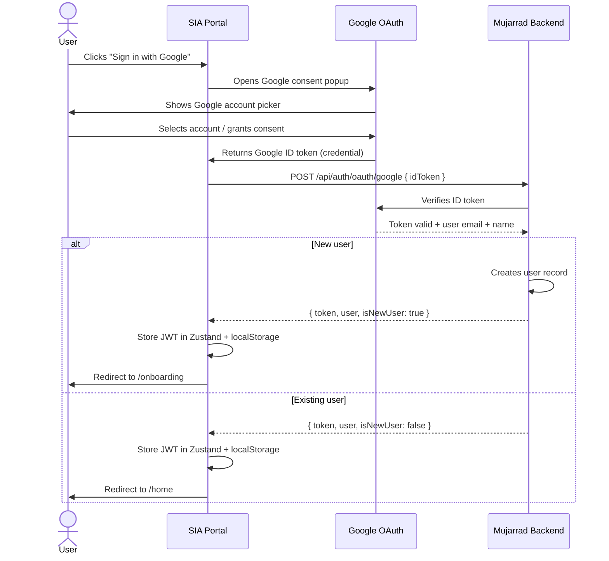

---

## 2. Partner Onboarding (New User)

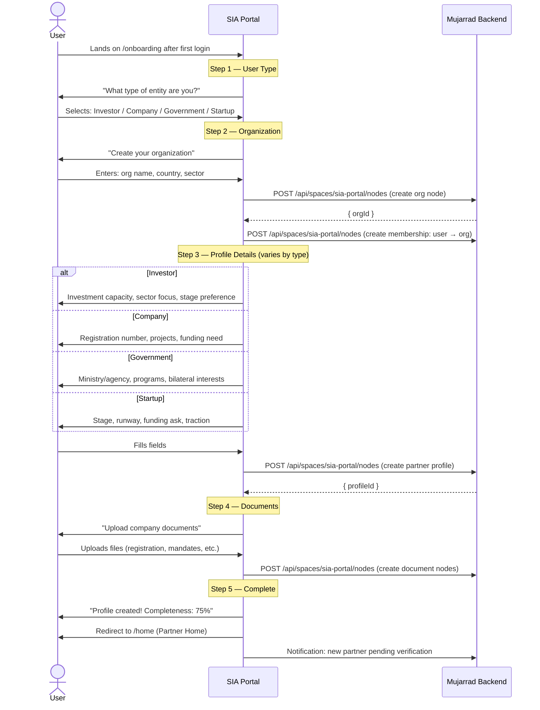

---

## 3. Invite Team Member to Organization

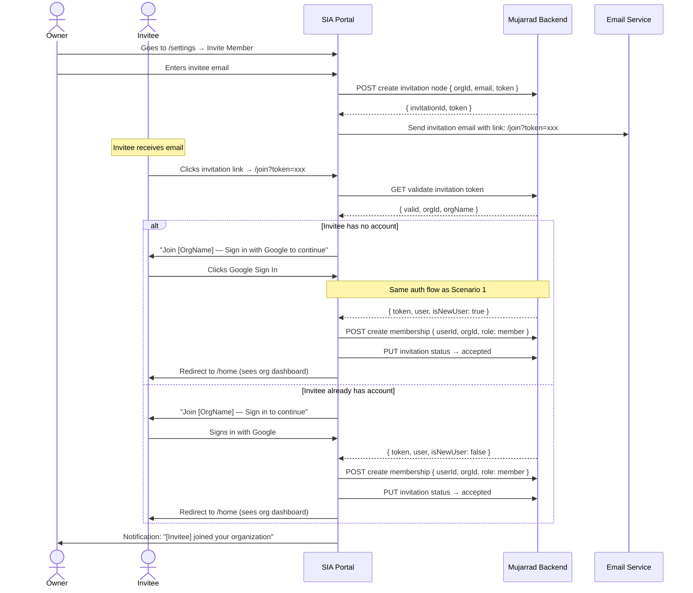

---

## 4. Admin Verifies Partner

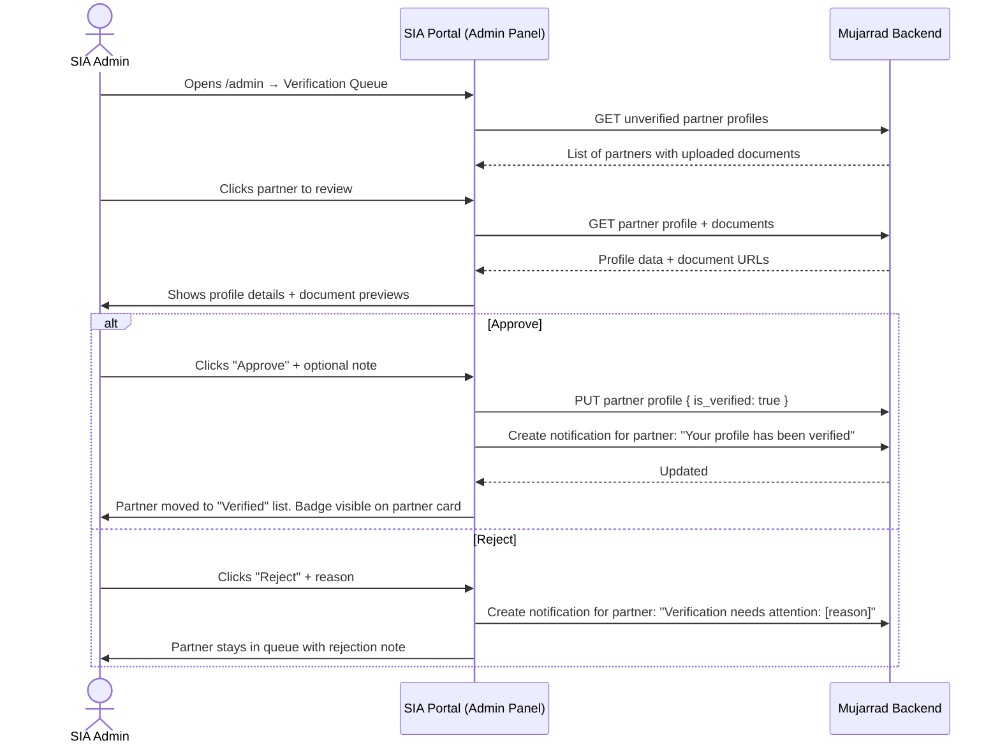

---

## 5. Admin Creates Match

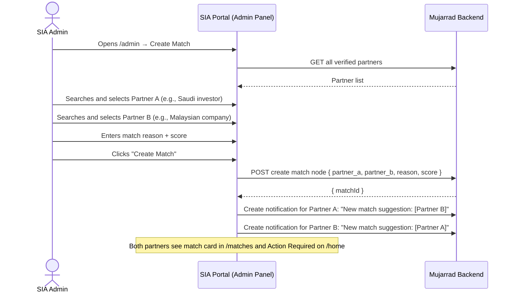

---

## 6. Partner Responds to Match (Two-Way Acceptance)

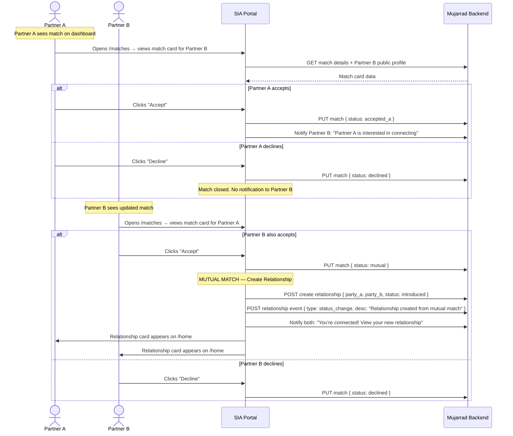

---

## 7. Relationship Status Progression

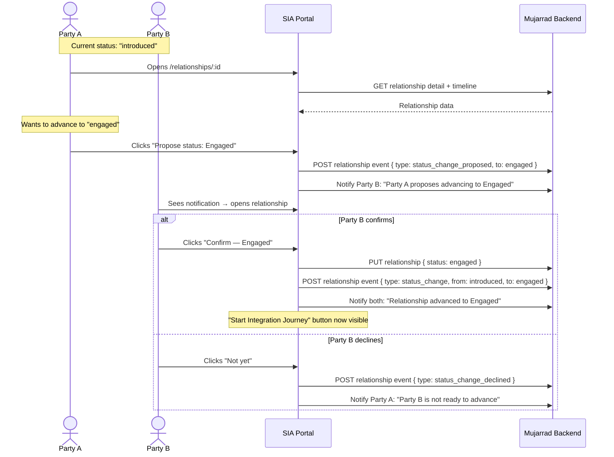

---

## 8. Document Upload & Signature Flow

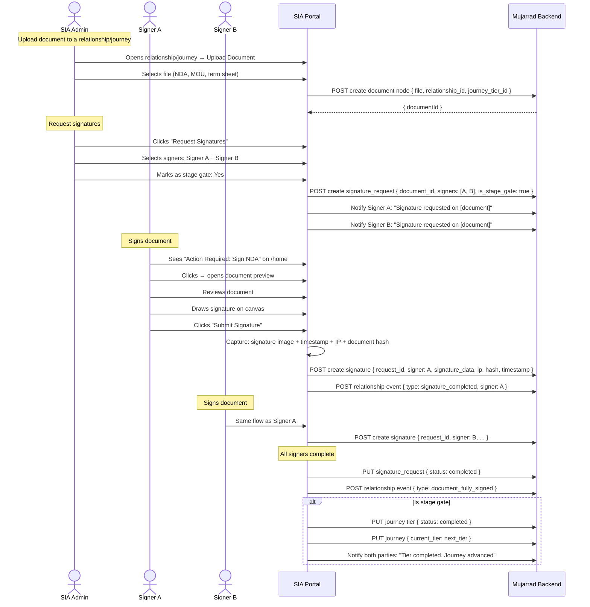

---

## 9. Start Integration Journey

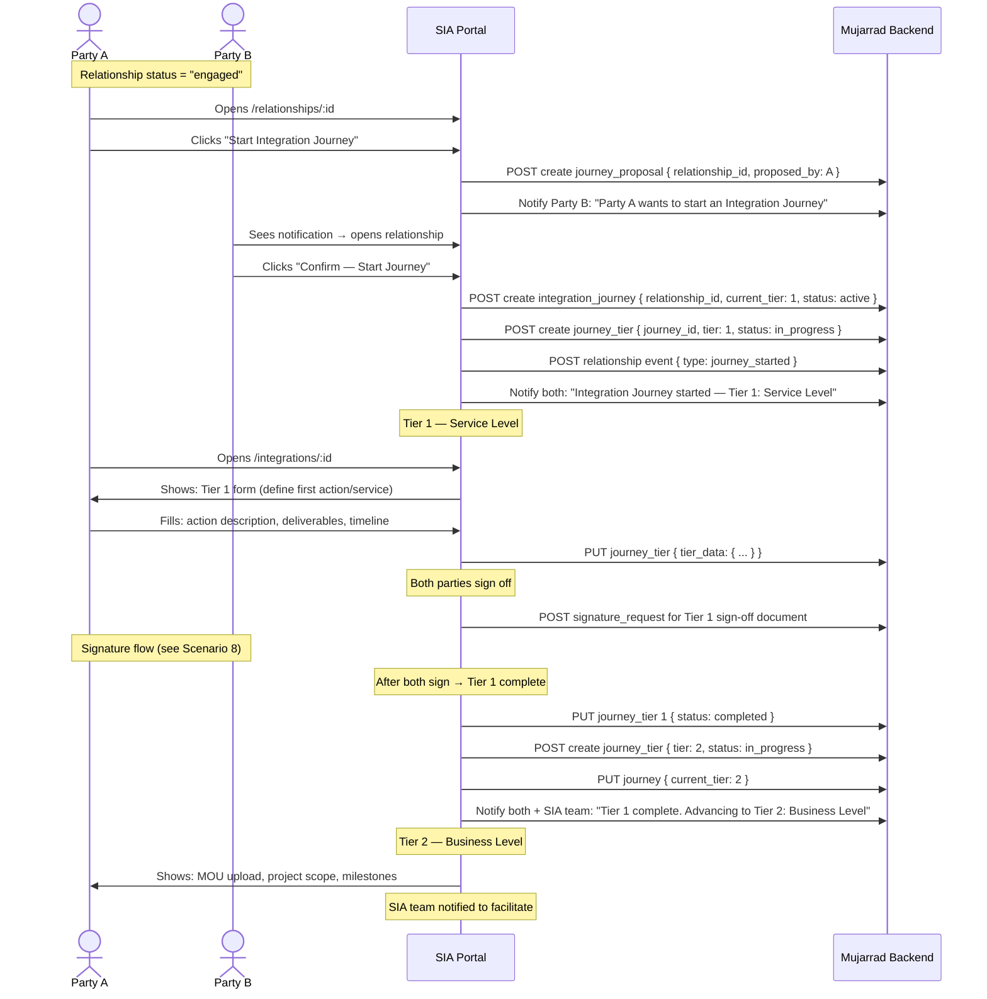

---

## 10. Portfolio Management

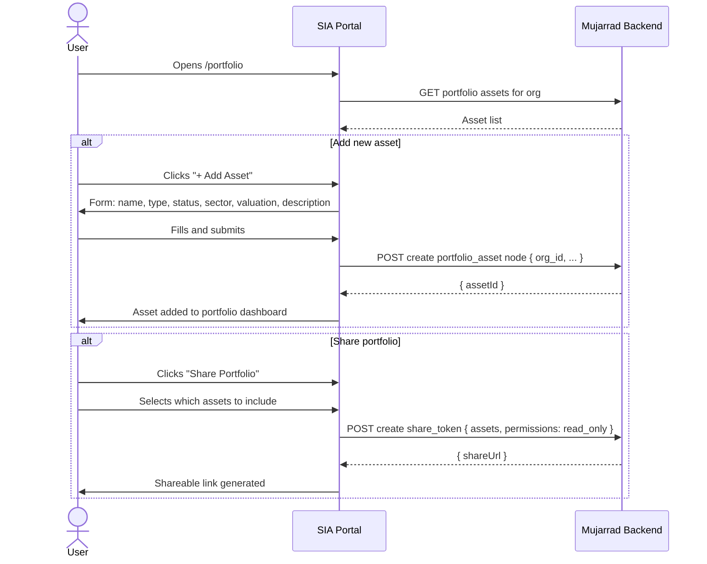

---

## 11. Financial Model Publish & Investor Interest

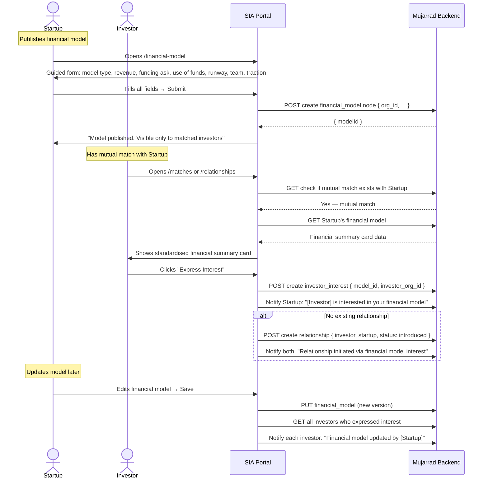

---

## 12. Admin Operations Overview

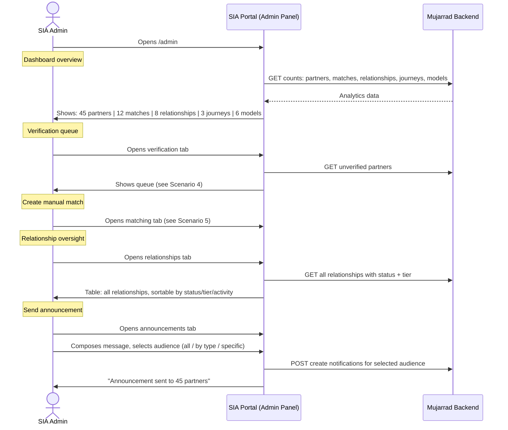
