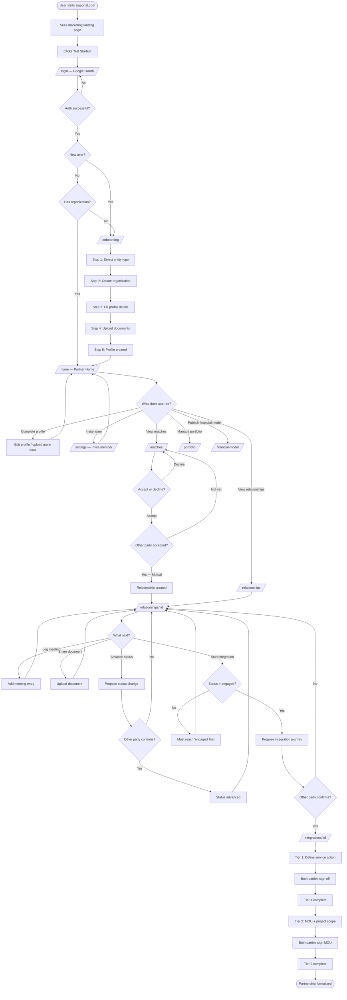
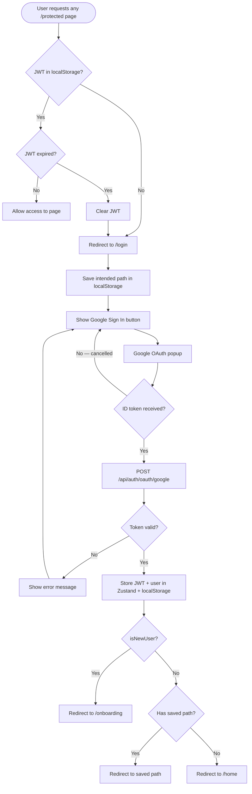
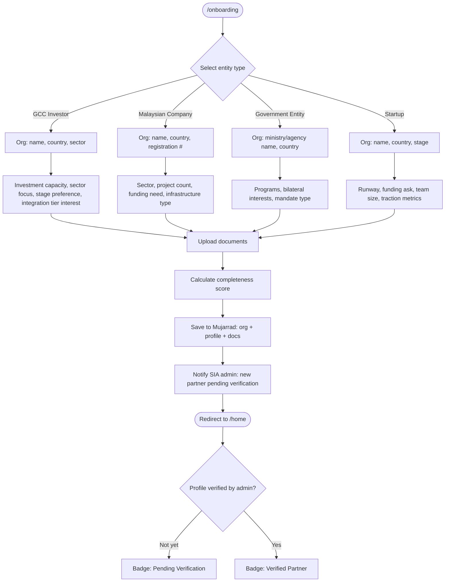
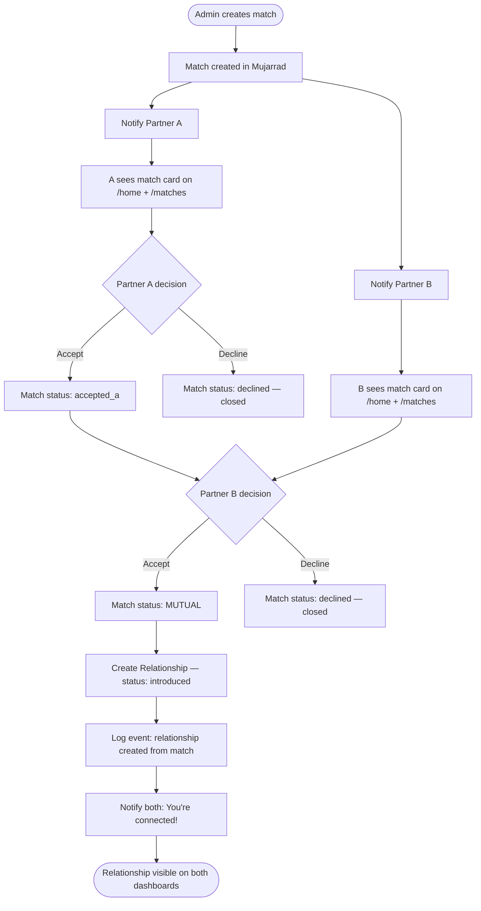
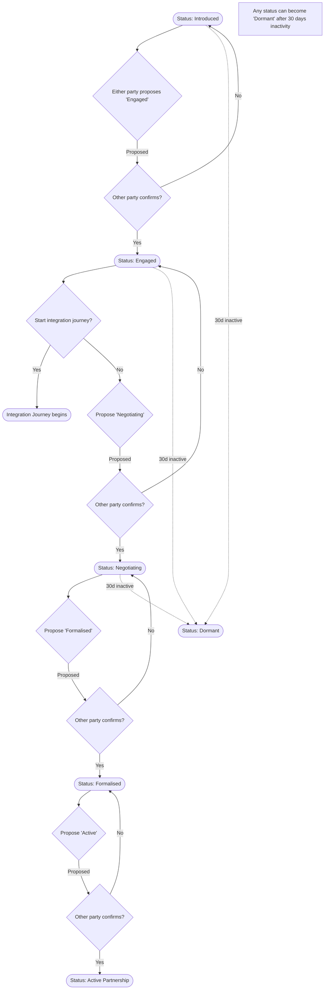
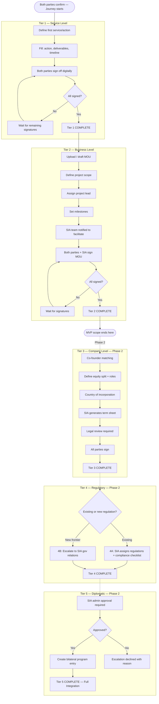
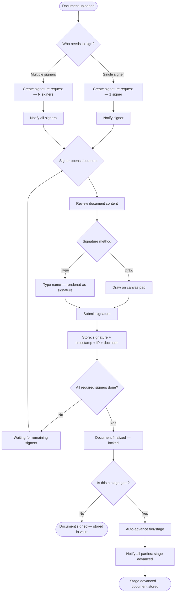
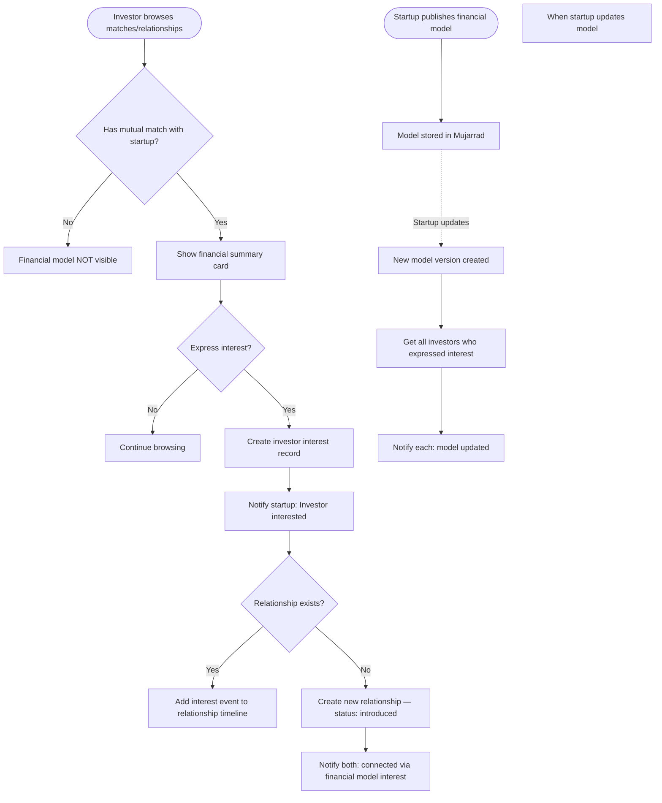

# Activity Diagrams

End-to-end user journeys showing every decision point and system action.

---

## 1. Complete User Journey — First Visit to First Integration



---

## 2. Authentication & Access Control



---

## 3. Partner Onboarding — All 4 Paths



---

## 4. Matching — Full Lifecycle



---

## 5. Relationship Progression



---

## 6. Integration Journey — Tier Progression



---

## 7. Digital Signature — Decision Flow



---

## 8. Financial Model — Visibility & Interest



---

## 9. Org Member Invitation — Complete Flow

```mermaid
flowchart TD
    OWNER([Owner opens /settings]) --> INVITE[Clicks 'Invite Member']
    INVITE --> EMAIL[Enters invitee email]
    EMAIL --> CREATE[Create invitation: token + email + org_id]
    CREATE --> SEND[Send invitation email]

    SEND --> INVITEE([Invitee receives email])
    INVITEE --> CLICK[Clicks invitation link]
    CLICK --> VALIDATE{Token valid and not expired?}
    VALIDATE -->|No — expired| EXPIRED[Show: invitation expired, ask owner to resend]
    VALIDATE -->|Yes| SHOW_ORG[Show: Join {OrgName}]

    SHOW_ORG --> HAS_ACCOUNT{Already has SIA account?}
    HAS_ACCOUNT -->|No| SIGNUP[Sign in with Google — new account created]
    HAS_ACCOUNT -->|Yes| SIGNIN[Sign in with Google — existing account]

    SIGNUP --> JOIN[Add user to org as member]
    SIGNIN --> JOIN
    JOIN --> MARK[Mark invitation as accepted]
    MARK --> NOTIFY_OWNER[Notify owner: {name} joined your organization]
    NOTIFY_OWNER --> HOME([Invitee redirected to /home — sees org dashboard])
```
